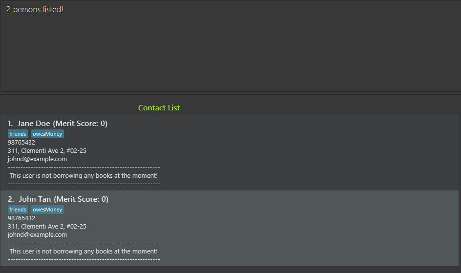
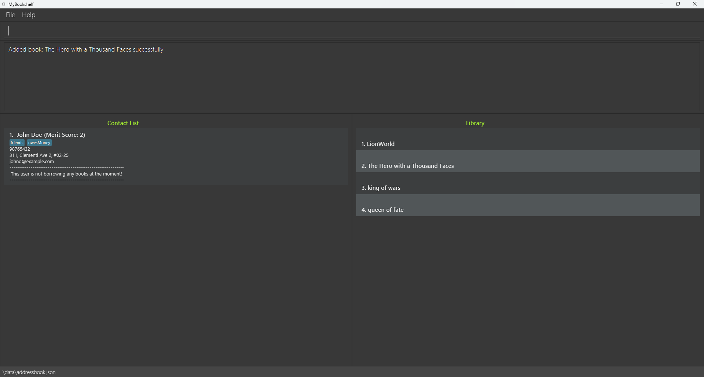
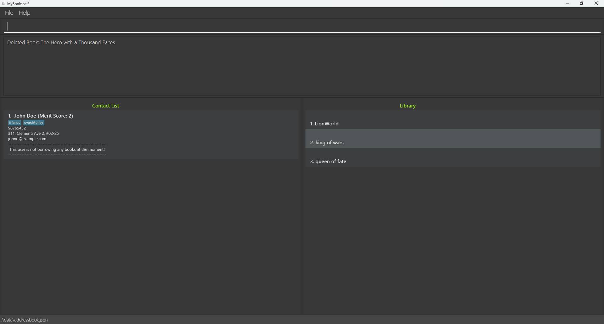
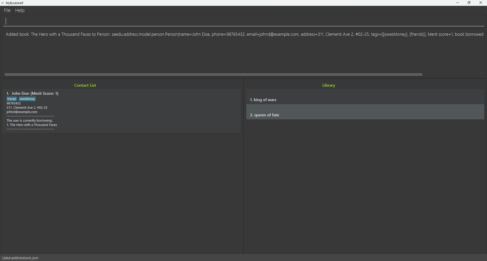

# MyBookshelf User Guide

MyBookshelf is a desktop application for community library managers to better manage user contacts, books, and borrowing activity.

It is optimised for use via a **Command Line Interface (CLI)** while not compromising on the benefits of a **Graphical User Interface (GUI)**. 

Tailored for fast typists, MyBookshelf can get your contact and borrowing management tasks done faster than traditional GUI apps.

<!-- * Table of Contents -->
<page-nav-print />

--------------------------------------------------------------------------------------------------------------------

## Quick start

1. Ensure that you have `Java 11` or above installed in your computer.

1. Download the latest `MyBookshelf.jar` from [here](https://github.com/AY2324S2-CS2103T-F11-2/tp/releases).

1. Paste the file into the folder you want to use as the _home folder_ for the MyBookshelf app.

1. Open the command terminal, `cd` into the folder you placed the jar file in, and enter the following command `java -jar MyBookshelf.jar` to run the application. 
   
1. A window similar to the one below should appear in a few seconds. Notice that the app initialises with some sample data. 
   

1. Type the command in the command box and press Enter to execute it. e.g. typing **`help`** and pressing Enter will open the help window. 
   Some example commands you can try:

    * `list` : Lists all users.

    * `add n/John Doe p/98765432 e/johnd@example.com a/John street, block 123, #01-01` : Adds a contact named `John Doe` to the Contact List.

    * `delete 3` : Deletes the 3rd user shown in the Contact List.

    * `clear` : Delete all users from the Contact List.

    * `exit` : Exits the app.

1. Refer to the [Features](#features) below for details of each command.

--------------------------------------------------------------------------------------------------------------------

## Features

<box type="info" seamless>

### **Notes about the command format:** 

* Words in `UPPER_CASE` are the parameters to be supplied by the user. 
  e.g. in `add n/NAME`, `NAME` is a parameter which can be used as `add n/John Doe`.

* Items in square brackets are optional. 
  e.g `n/NAME [t/TAG]` can be used as `n/John Doe t/friend` or as `n/John Doe`.

* Items with `…`​ after them can be used multiple times including zero times. 
  e.g. `[t/TAG]…​` can be used as ` ` (i.e. 0 times), `t/friend` (i.e. 1 times), `t/friend t/family t/TAGS ...` (i.e. multiple times).

* Parameters can be in any order. 
  e.g. if the command specifies `n/NAME p/PHONE_NUMBER`, `p/PHONE_NUMBER n/NAME` is also acceptable.

* Extraneous parameters for commands that do not take in parameters (such as `help`, `list`, `exit` and `clear`) will be ignored. 
  e.g. if the command specifies `help 123`, it will be interpreted as `help`.

* If you are using a PDF version of this document, be careful when copying and pasting commands that span multiple lines as space characters surrounding line-breaks may be omitted when copied over to the application.
</box>

<box type="info" seamless>

### **Notes about the parameters used:** 

* `NAME`: The name of the library user to be added.
   * Only alphanumeric names with spaces can be used.
   * Not allowed to add special characters like `/`, `-` and `,` in names.
   * `NAME` is case-sensitive.

* `PHONE_NUMBER`: The phone number of the library user.
  * Has a minimum limit of 3 digits.
  * No maximum limit currently set on the phone number.

* `EMAIL`: The email address of the library user.
  * Valid as long as it follows the format of `local-part@domain
  * `local-part` contains alphanumeric characters and some special characters such as `+`, `_`, `.` and `-`.
  * `local-part` may not start or end with any special characters.
  * `local-part` must be followed with an `@`.
  * `domain` is made up of one or more `domain label`.
    * Each `domain label` is separated by a `.`.
    * Each `domain label` must be at least 2 characters long.
    * Each `domain label` must start and end with alphanumeric characters.
    * Each `domain label` contains alphanumeric characters, separated only by `-`, if any.

* `ADDRESS`: The home address of the library user.
  * Can take on any values, but should not be blank.

* `TAG`: To associate library users with extra information.
  * Only alphanumeric tags can be used.
  * No spaces allowed within a tag (only a single word per tag).

* `INDEX`: The number associated with the position of each library user in the Contact List.
  * Assigned to library users based on the order added into the Contact List.
[//]: # (todo check should we change the definiton of this index or not)
[//]: # (  * `INDEX` refers to the number shown in the displayed Contact List.)
  * Takes in a **positive integer** (e.g. 1, 2, 3, …​) up to the last `INDEX` in the Contact List.
  * Can only take up to 2147483647. Refer here for more information.

* `KEYWORD`: The part of the word you are searching for.
  * `KEYWORD` is case-insensitive.

* `BOOKTITLE`: The title of the book.
  * Can take on any values, but should not be blank.
  * `BOOKTITLE` is case-sensitive.

* `THRESHOLD`: The merit score limit set for each library user.
  * Takes in integer values.
  * Can only take in values from -2147483648 to 2147483647. Refer here for more information.

<box type="info" seamless>

### **Others:** 

* This application is designed for use in **English**. We cannot guarantee the performance when used with other languages.
* **Duplicated library users** are defined as users with the same name (case-sensitive). We currently do not allow duplicated users to be added.

--------------------------------------------------------------------------------------------------------------------
### Viewing help : `help`

Shows a message explaining how to access the help page.

Format: `help`

### Adding a user: `add`

Adds a user with user's personal information into the Contact List .

Format: `add n/NAME p/PHONE_NUMBER e/EMAIL a/ADDRESS [t/TAG]…​`

<box type="tip" seamless>

**Tip:** A user can have any number of tags (including 0)
</box>

Examples:
* `add n/John Doe p/98765432 e/johnd@example.com a/John street, block 123, #01-01`

### Listing all users : `list`

Shows a list of all users in the Contact List.

Format: `list`

### Editing a user : `edit`

Edits an existing user's personal information from the Contact List.

Format: `edit INDEX [n/NAME] [p/PHONE] [e/EMAIL] [a/ADDRESS] [t/TAG]…​`

* Edits the user at the specified `INDEX`. The index refers to the index number shown in the displayed Contact List.
* At least one of the optional fields must be provided.
* Existing values will be updated to the input values.
* When editing tags, the existing tags of the user will be removed i.e adding of tags is not cumulative.
* You can remove all the user’s tags by typing `t/` without specifying any tags after it.

Examples:
*  `edit 2 n/Betsy Crower e/betsy@example.com t/` Edits the name and email address of the 2nd person to be `Betsy Crower` and `betsy@example.com`, simultaneously clears all existing tags.

### Locating users by name: `find`

Finds users whose names contain any of the given keywords.

Format: `find KEYWORD [MORE_KEYWORDS]`

* The search is case-insensitive. e.g `hans` will match `Hans`
* The order of the keywords does not matter. e.g. `Hans Bo` will match `Bo Hans`
* Only the name is searched.
* Only full words will be matched e.g. `Han` will not match `Hans`
* Users matching at least one keyword will be returned (i.e. `OR` search).
  e.g. `Hans Bo` will return `Hans Gruber`, `Bo Yang`

Examples:
* `find alex david` returns `Alex Yeoh`, `David Li` 
  

### Deleting a user : `delete`

Deletes the specified user from the Contact List using index.

Format: `delete INDEX`

* Deletes the user at the specified `INDEX`.
* The index refers to the index number shown in the displayed Contact List.

Examples:
* `list` followed by `delete 2` deletes the 2nd user in the Contact List.
* `find Betsy` followed by `delete 1` deletes the 1st user in the results of the `find` command.

### Add a book to Library : `addbook`

Records the library manager adding a book to the library.

Format: `addbook b/BOOKTITLE`

* Library Manager has added book `BOOKTITLE`.

Examples:
* `addbook b/The Hero with a Thousand Faces` will add a book titled "The Hero with a Thousand Faces" into the library.
  

### Delete a book from Library : `delbook`

Records the library manager deleting a book from the library.

Format: `delbook b/BOOKTITLE`

* Library Manager has deleted book `BOOKTITLE`.

Examples:
* `delbook b/The Hero with a Thousand Faces` will remove a book titled "The Hero with a Thousand Faces" from the library.
  

// todo Add note saying that delbook will remove the first book where the name matches (not all the books)

### Borrow a book by a user: `borrow`

Borrow a book from the library by a user.

Format: `borrow INDEX b/BOOKTITLE`

* Borrow the book with `BOOKTITLE` to user `INDEX`.
* The index refers to the index number shown in the displayed Contact List.

Examples:
* `borrow 1 b/The Hero with a Thousand Faces` will record user index 1, borrows a book called "The Hero with a Thousand Faces".

### Return a book from a user : `return`

Returns the specified book borrowed by the specified user.

Format: `return INDEX b/BOOKTITLE`

* Return a book `BOOKTITLE` borrowed by user `INDEX`.
* The index `INDEX` refers to the index number shown in the displayed Contact List.

Examples:
* `return 1 b/The Hero with a Thousand Faces` returns a book of title "The Hero with a Thousand Faces" from the user at index 1. 

### Donate a book from a user : `donate`

Records a user donating a book to the library.

Format: `donate INDEX b/BOOKTITLE`

* A user `INDEX` has donated book `BOOKTITLE`.
* The index refers to the index number shown in the displayed Contact List.
* For every book that is successfully donated, user's merit score increases by 1.

Examples:
* `donate 4 b/The Hero with a Thousand Faces` will record user index 4, donates a book called "The Hero with a Thousand Faces".

### Set the merit score threshold of the library: `limit`

Sets the limit of the library such that only users with a merit score more than or equal to the set limit can borrow.

Format: `limit [THRESHOLD]`

* Sets the limit of the merit score to the specified `THRESHOLD`.
* The limit refers to the threshold such that any user with a merit score less the `THRESHOLD` is not allowed to borrow from the library.
* `THRESHOLD` can be any integer.
* `THRESHOLD` is optional. Typing `limit` without `THRESHOLD` will display the currently set threshold.
* The default threshold set for libraries is -3.

Examples:
* `limit` will display the current limit.
* `limit -4` will set the limit of the library to -4

### Clearing all entries : `clear`

Clears all entries from the Contact List.

Format: `clear`

### Exiting the program : `exit`

Exits the program.

Format: `exit`

[//]: # (### )

[//]: # ()
[//]: # (Description)

[//]: # ()
[//]: # (Format: ``)

### Saving the data

MyBookshelf offers an automated data saving feature, 
ensuring that any modifications to your library's records are promptly preserved on your hard disk without necessitating manual intervention.
This functionality simplifies your workflow by automatically saving your progress, enabling seamless continuation from your last session upon reopening the application. 
 
MyBookshelf also focuses on data integrity, guaranteeing that only accurate records are maintained within the system.
Invalid data for available books will be automatically discarded and that particular data will not be saved.

### Editing the data file

MyBookshelf user's data are saved automatically as a JSON file `[JAR file location]/data/addressbook.json`.
MyBookshelf library available books data are saved automatically as a txt file at `[JAR file location]/data/library.txt`.
Advanced users are welcome to update data directly by editing that data file.

<box type="warning" seamless>

**Caution:**
If your changes to the data file makes its format invalid, MyBookshelf will discard all data and start with an empty data file at the next run. Hence, it is recommended to take a backup of the file before editing it. 
Furthermore, certain edits can cause the MyBookshelf to behave in unexpected ways (e.g., if a value entered is outside the acceptable range). Therefore, edit the data file only if you are confident that you can update it correctly.
</box>

--------------------------------------------------------------------------------------------------------------------

## Note

1. Every user starts from merit score 0.
1. Donating increases merit score by 1.
1. Borrowing is **ONLY** allowed for user with **Merit Score >= Threshold** (Threshold can be set by using `limit` command.
1. Users can borrow multiple books as long as they have sufficient merit score.
1. The default threshold is set at -3.
1. Threshold can be set by librarian multiple times.
1. `edit` command only supports editing user's personal information (name, phone number, email, address and tags, but not merit score and borrowed books).
1. `add` command is used to record new user's personal information into the Contact List.
1. `add` and `edit` command **DOES NOT** support adding/editing merit score or borrowed book.
1. `add`, `delete`, `edit`, `clear` and `find` commands are for managing users, while `addbook`, `delbook`, `borrow`, `donate` and `return` commands are for managing books.
1. `borrow` command is cases-sensitive to allow books of similar titles to be differentiated.
1. `delbook` deletes one book at a time to prevent accidental deletion of all entries with the same book  title.
1. Email and phone numbers have not been made unique identifiers as there may be case scenarios where two users might share the same email or phone number such as small child and a parent.
1. Book title is used instead of index as there is no urgent need for current functions like `borrow` or `addbook`. Furthermore, there is a plan to implement a findbook function in the future which will require use of book title. If booktitle is the same, include author name or other distinguishing features in brackets to differentiate book under `donate` and `addbook` commands.
1. `delete` command will delete users along with any books borrowed. This is to allow for more flexibility. If books are returned, community library manager can use `return` command to include the books back into the list.
1. There are no constraints for book titles (except empty book title) as book title can be in any form (e.g. Book title with additional whitespaces) and in any languages (e.g. Chinese or Arabic).

--------------------------------------------------------------------------------------------------------------------

## Future Features

### Introducing more flexibility for `clear`
1. Will be adding a `clearlib` command to clear all books currently in the library.
2. Will rename the current `clear` command to `clearuser` to clear all the data of library users.
3. Will be adding a `clearall` command to clear both library book and library user data.

### Introducing unique id for books
1. Will be adding a id parameter for book object to allow each book copy of the same title to be unique.

### Archiving data files
_Details coming soon..._
--------------------------------------------------------------------------------------------------------------------

## FAQ

**Q**: How do I transfer my data to another Computer? 
**A**: Install the app in the other computer and overwrite the empty data file it creates with the file that contains the data of your previous MyBookshelf home folder.

--------------------------------------------------------------------------------------------------------------------

## Known issues

1. **When using multiple screens**, if you move the application to a secondary screen, and switch back to the primary screen, the GUI will open off-screen. The remedy is to delete the `preferences.json` file created by the application before running the application again.
2. Email does not check for presence of **top-level domain**, such as `.com`, `.net` and `.org`. Refer to the Developer Guide for more information.
3. When a value beyond the range `-2147483648 to 2147483647` is used for `INDEX` and `THRESHOLD`, the wrong error message is displayed. Will be fixed in the future. Refer to the Developer Guide for more information.
4. There can be different individuals with the same name, but our current implementation does not support this due to our definition of duplicated people. Will be fixed in the future. Refer to the Developer Guide for more information.
5. Duplicated library users can be added with the same name but different capitalisation, due to our definition of duplicated people. Will be fixed in the future. Refer to the Developer Guide for more information.
6. All parameters except `INDEX` and `THRESHOLD` do not have a limit to the number of characters. Refer to the Developer Guide for more information.
7. The `clear` command only clears the library user data. The usage pertaining to this command will be made clearer with the implementation of future features. Refer to the **Future Features** section above for more information.
8. UI may not display special characters as intended. 
9. Some languages may cause the UI to display unexpectedly. For example, Arabic characters will cause the text starts from right to left.

--------------------------------------------------------------------------------------------------------------------

## Command summary

| Action      | Format, Examples                                                                                                                                                           |
|-------------|----------------------------------------------------------------------------------------------------------------------------------------------------------------------------|
| **Add**     | `add n/NAME p/PHONE_NUMBER e/EMAIL a/ADDRESS [t/TAG]…​`   e.g., `add n/James Ho p/22224444 e/jamesho@example.com a/123, Clementi Rd, 1234665 t/goodDonater t/sponsor`   |
| **Clear**   | `clear`                                                                                                                                                                    |
| **Delete**  | `delete INDEX`  e.g., `delete 3`                                                                                                                                        |
| **Edit**    | `edit INDEX [n/NAME] [p/PHONE_NUMBER] [e/EMAIL] [a/ADDRESS] [t/TAG]…​`  e.g.,`edit 2 n/James Lee e/jameslee@example.com`                                                |
| **Find**    | `find KEYWORD [MORE_KEYWORDS]`  e.g., `find James Jake`                                                                                                                 |
| **List**    | `list`                                                                                                                                                                     |
| **Help**    | `help`                                                                                                                                                                     |
| **AddBook** | `addbook b/BOOKTITLE`  e.g., `addbook b/The Hero with a Thousand Faces`                                                                                                 |
| **DelBook** | `delbook b/BOOKTITLE`  e.g., `delbook b/The Hero with a Thousand Faces`                                                                                                 |
| **Borrow**  | `borrow INDEX b/BOOKTITLE`  e.g., `borrow 1 b/The Hero with a Thousand Faces`                                                                                           |
| **Return**  | `return INDEX b/BOOKTITLE`  e.g., `return 1  b/The Hero with a Thousand Faces`                                                                                          |
| **Donate**  | `donate INDEX b/BOOKTITLE`  e.g., `donate 1 b/The Hero with a Thousand Faces`                                                                                           |
| **Limit**   | `limit THRESHOLD`   e.g. `limit 0`                                                                                                                                      |
