# MyBookshelf User Guide

*MyBookshelf* is a desktop application for community library managers to better manage library user contacts, books, and borrowing activity.

It is optimised for use via a **Command Line Interface (CLI)** while not compromising on the benefits of a **Graphical User Interface (GUI)**.

Tailored for fast typists, MyBookshelf can get your contact and borrowing management tasks done faster than traditional GUI apps.

<!-- * Table of Contents -->
<page-nav-print />

--------------------------------------------------------------------------------------------------------------------

## Quick start

### Windows
1. Ensure that you have `Java 11` or above installed in your computer.
   - You can refer to this [YouTube video](https://www.youtube.com/watch?v=3nOmkqO0-SM) to check your current Java version. 
   - If you do not have `Java 11`, you are recommended to download it from [here](https://www.oracle.com/java/technologies/javase/jdk11-archive-downloads.html)

1. Download the latest `mybookshelf.jar` from [here](https://github.com/AY2324S2-CS2103T-F11-2/tp/releases).

1. Copy and paste the file to you will use as the _home folder_ for the *MyBookshelf* app.
    - Open your _file explorer_ with Windows Key + E or clicking the _file explorer_ icon.
    - Navigate to the _Downloads_ folder (Default directory for downloaded files will be the _Downloads_ folder).
    - Copy the downloaded `mybookshelf.jar` and paste it to the folder you will use as the _home folder_ for the *MyBookshelf* app.

1. Access the command prompt.
    - Open the Run menu with Windows Key + R, then type "cmd".<br>
      <br>
    - Click "Ok".
    - Command prompt window will appear in a few seconds. Command prompt window should look similar the image below.<br>
      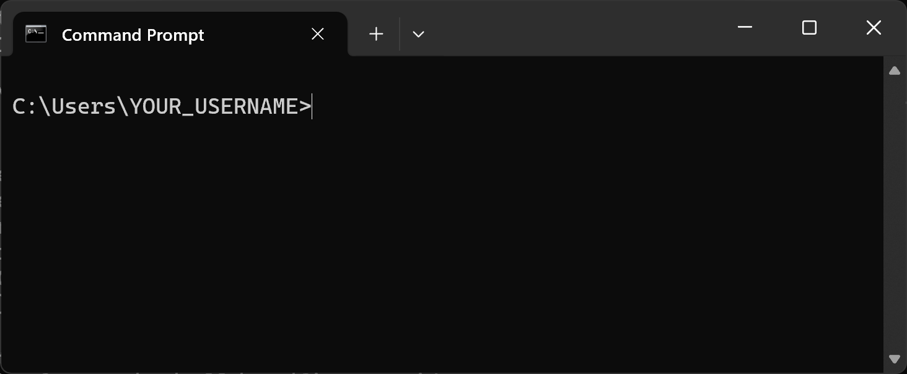<br>
    - If you have issues opening command prompt, you can refer this [YouTube video](https://www.youtube.com/watch?v=pBheH2QtktI&t=92s).
      
1. `cd` into the folder you placed `mybookshelf.jar` file in, and enter the following command to run the application.<br>
  ```
  java -jar mybookshelf.jar
  ```
   - You can refer to the image below.<br> 
     _Note_: _YOUR_USERNAME_ and _HOME_FOLDER_FOR_MYBOOKSHELF_ might be different from yours.<br>
   <br>

1. A window similar to the one below should appear in a few seconds. Notice that the app initialises with some sample data.<br>

   <br>

1. Type the command into the command box and press Enter to execute it. e.g. typing [**`help`**](#viewing-help--help) and pressing Enter will open the help window.<br>

1. You can refer to [Glossary](#glossary) for the definition of some words used and [Command Summary](#command-summary) for a quick overview of the commands. Refer to the [Features](#features) below for more details of each command.


### MacOS
1. Ensure that you have `Java 11` or above installed in your computer.
    - You can refer to this [YouTube video](https://www.youtube.com/watch?v=3nOmkqO0-SM) to check your current Java version.
    - If you do not have `Java 11`, you are recommended to download from [here](https://www.azul.com/downloads/?version=java-11-lts&os=macos&architecture=arm-64-bit&package=jdk-fx)

1. Download the latest `mybookshelf.jar` from [here](https://github.com/AY2324S2-CS2103T-F11-2/tp/releases).

1. Copy and paste the file to you will use as the _home folder_ for the *MyBookshelf* app.
    - Open your _finder_ by clicking the _finder_ icon.
    - Navigate to the _Downloads_ folder (Default directory for downloaded files will be the _Downloads_ folder).
    - Copy the downloaded `mybookshelf.jar` and paste it to the folder you will use as the _home folder_ for the *MyBookshelf* app.

1. Access the terminal.
    - Open the Spotlight search window using Command + Space, then type "Terminal".
    - Double-click on Terminal in search result.<br>
      <br>
    - Terminal window will appear in a few seconds. Terminal window should look similar the image below.<br>
      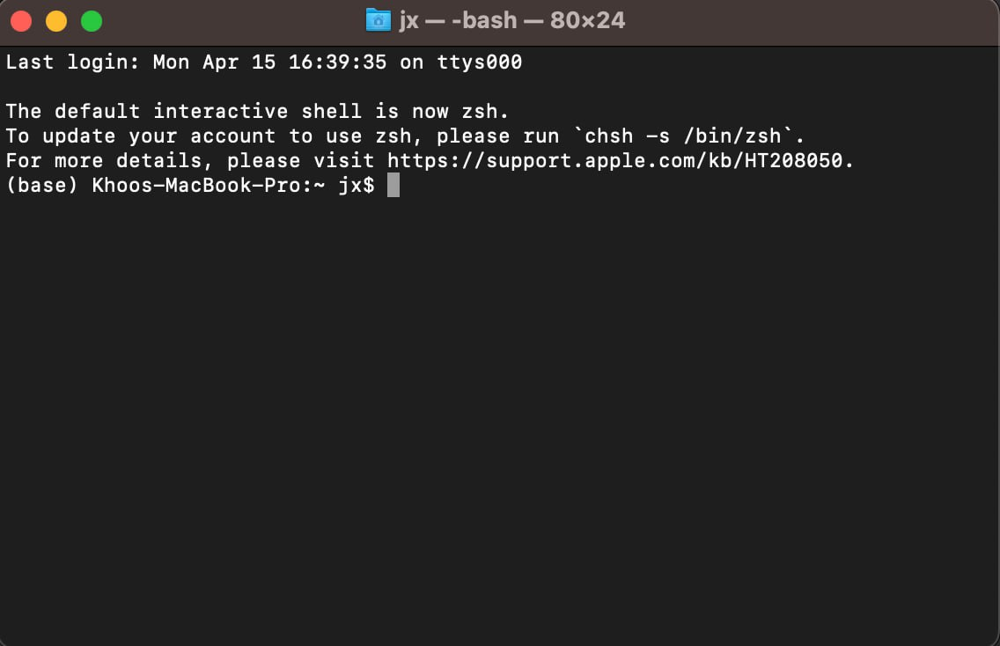<br>
    - If you have issues opening Terminal window, you can refer [here](https://discussions.apple.com/thread/366608?sortBy=best)

1. `cd` into the folder you placed `mybookshelf.jar` file in, and enter the following command to run the application.<br>
  ```
  java -jar mybookshelf.jar
  ```
   - You can refer to the image below.<br>
     _Note_: _YOUR_USERNAME_ and _HOME_FOLDER_FOR_MYBOOKSHELF_ might be different from yours.<br>
   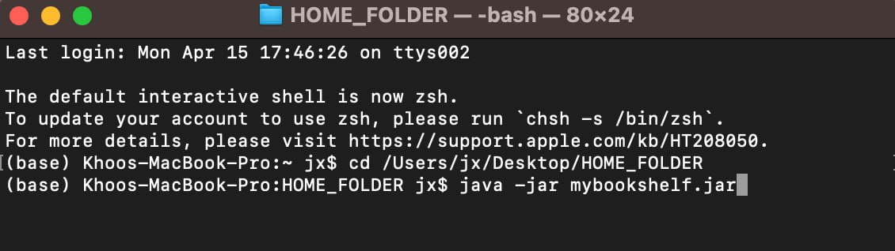<br>


1. A window similar to the one below should appear in a few seconds. Notice that the app initialises with some sample data.<br>

   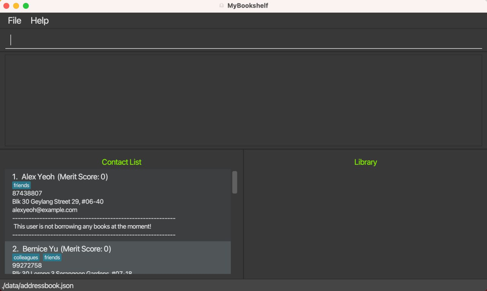

1. Type the command into the command box and press Enter to execute it. e.g. typing [**`help`**](#viewing-help--help) and pressing Enter will open the help window.<br>

1. You can refer to [Glossary](#glossary) for the definition of some words used and [Command Summary](#command-summary) for a quick overview of the commands. Refer to the [Features](#features) below for more details of each command.

--------------------------------------------------------------------------------------------------------------------

## A Quick Walkthrough of MyBookshelf


### Overview:
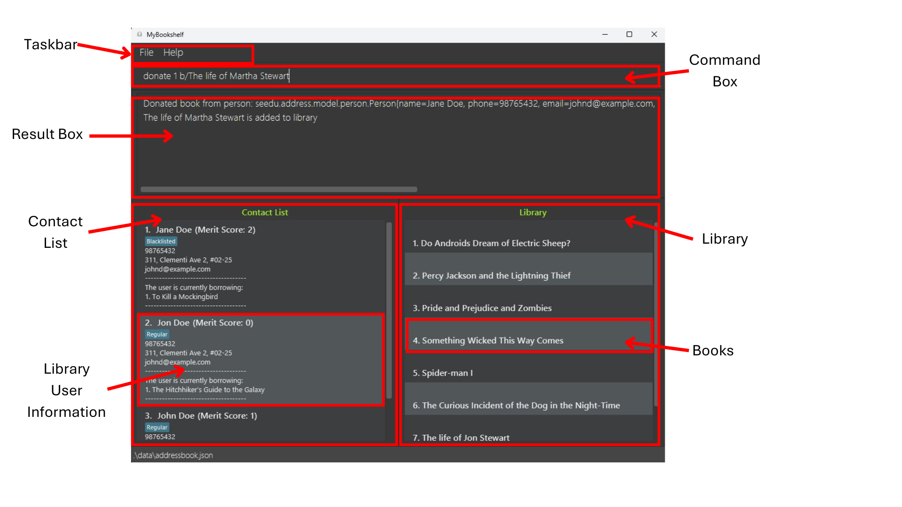


1. **Taskbar:** Where library managers can access the `File` and `Help` tabs.
2. **Command Box:** Where library managers can type in their commands into *MyBookshelf*.
3. **Result Box:** This is where *MyBookshelf* returns the relevant output to the commands received.
4. **Contact List:** Contains the list of **Library User Information**.
5. **Library User Information:** This is where the particulars of individual library users are displayed at. More details to follow in the next part.
6. **Library:** Contains the list of **Books** currently available in the library.
7. **Books:** Identified by their titles, this is where each book in the library is displayed.


### Library User Information:
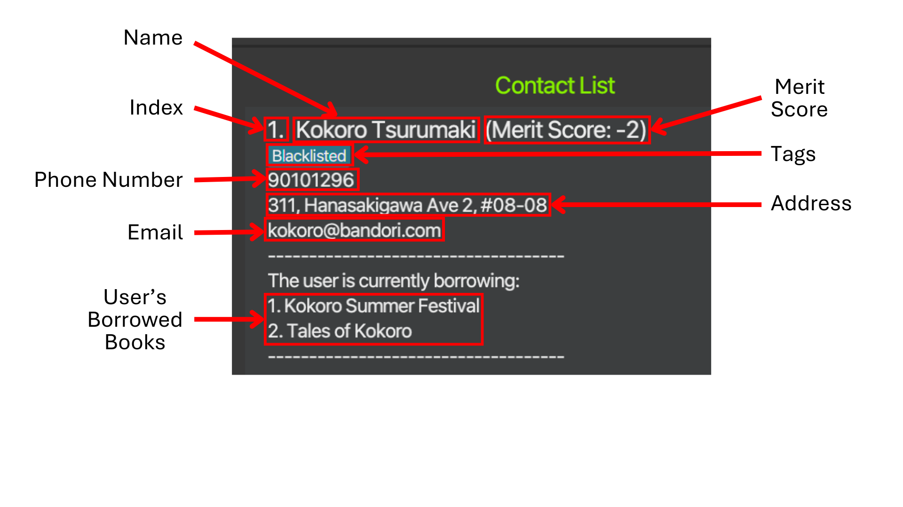


1. **Name:** The name of the library user.
2. **Index:** The sorted position of the library user in the contact list.
3. **Merit Score:** The merit score associated with the library user. This term is defined below at the *Glossary* section.
4. **Tags:** Tags associated with the library user.
5. **Phone Number:** The phone number of the library user.
6. **Address:** The home address of the library user.
7. **Email:** The email address of the library user.
8. **User's Book List:** The list of books that the library user is currently borrowing from the library.


--------------------------------------------------------------------------------------------------------------------

## Features

<box type="info" seamless>

### **Notes about the command format:**<br>

* Words in `UPPER_CASE` are the parameters to be supplied by the user.<br>
  e.g. in `add n/NAME`, `NAME` is a parameter which can be used as `add n/John Doe`.


* Items in square brackets are optional.<br>
  e.g `n/NAME [t/TAG]` can be used as `n/John Doe t/friend` or as `n/John Doe`.


* Items with `…`​ after them can be used multiple times including zero times.<br>
  e.g. `[t/TAG]…​` can be used as ` ` (i.e. 0 times), `t/friend` (i.e. 1 times), `t/friend t/family t/TAGS ...` (i.e. multiple times).


* Parameters can be in any order.<br>
  e.g. if the command specifies `n/NAME p/PHONE_NUMBER`, `p/PHONE_NUMBER n/NAME` is also acceptable.


* Extraneous parameters for commands that do not take in parameters (such as `help`, `list`, `exit` and `clear`) will be ignored.<br>
  e.g. if the command specifies `help 123`, it will be interpreted as `help`.


* If you are using a PDF version of this document, be careful when copying and pasting commands that span multiple lines as space characters surrounding line-breaks may be omitted when copied over to the application.

</box>

<box type="info" seamless>

### **Notes about the parameters used:**<br>

* `NAME`: The name of the library user to be added.
   * Only alphanumeric names with spaces can be used.
   * Not allowed to add special characters like `/`, `-` and `,` in names.
   * `NAME` is case-sensitive.


* `PHONE_NUMBER`: The phone number of the library user.
  * Requires a minimum of 3 digits.
  * No maximum limit currently set on the phone number.


* `EMAIL`: The email address of the library user.
  * Valid as long as it follows the format of `local-part@domain`.
  * `local-part` contains alphanumeric characters and some special characters such as `+`, `_`, `.` and `-`.
  * `local-part` may not start or end with any special characters.
  * `local-part` must be followed with an `@`.
  * `domain` is made up of one or more `domain label`.
    * Each `domain label` is separated by a `.`.
    * Each `domain label` must be at least 2 characters long.
    * Each `domain label` must start and end with alphanumeric characters.
    * Each `domain label` contains alphanumeric characters, separated only by `-`, if any.


* `ADDRESS`: The home address of the library user.
  * Can take on any values, but should not be blank.


* `TAG`: To associate library users with extra information.
  * Only alphanumeric tags can be used.
  * No spaces allowed within a tag (only a single word per tag).


* `INDEX`: The number associated with the position of each library user in the current displayed Contact List.
  * Assigned to library users based on the order added into the contact list.
  * Takes in a **positive integer** (e.g. 1, 2, 3, …​) up to the last `INDEX` in the contact list.
  * Can only take up to 2147483647.


* `KEYWORD`: The part of the word you are searching for.
  * `KEYWORD` is case-insensitive.


* `BOOKTITLE`: The title of the book.
  * Can take on any values, but should not be blank.
  * `BOOKTITLE` is case-sensitive.


* `THRESHOLD`: The merit score limit set for each library user.
  * Takes in integer values.
  * Can only take in values from -2147483648 to 2147483647.

</box>

<box type="info" seamless>

### **Others:**<br>

* This application is designed for use in **English**. We cannot guarantee the performance when used with other languages.
* **Duplicated library users** are defined as library users with the same name (case-sensitive).<br> We currently do not allow duplicated library users to be added.

</box>

--------------------------------------------------------------------------------------------------------------------
### Viewing help : `help`

Shows a message explaining how to access the help page.


Format: `help`


### Adding a library user: `add`

Adds a new library user to the contact list. Parameters are populated with the library user's personal information.

Format: `add n/NAME p/PHONE_NUMBER e/EMAIL a/ADDRESS [t/TAG]…​`

<box type="tip" seamless>

**Tip:** A user can have any number of tags (including 0).

</box>

<box type="note" seamless>

**Note:** User with name identical to another user is deemed as a duplicate (case-sensitive), even when other information is different.

</box>

Example:
* `add n/Kokoro Tsurumaki p/980101296 e/kokoro@bandori.com a/311, Hanasakigawa Ave 2, #08-08`


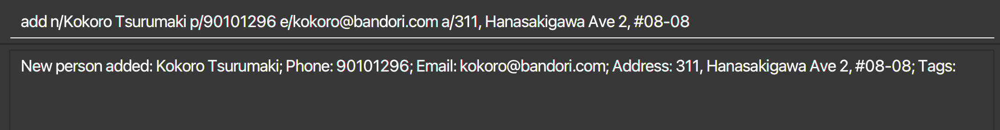


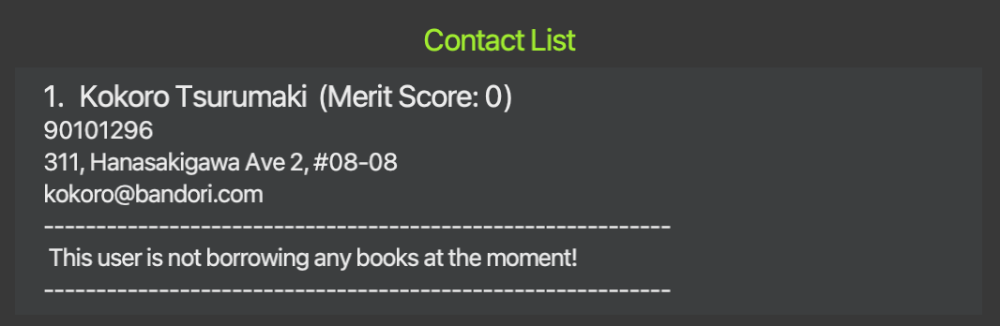

### Listing all library users : `list`

Displays a list of all library users in the contact list.

Format: `list`


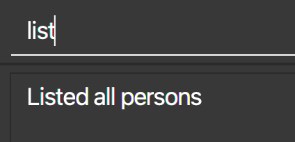


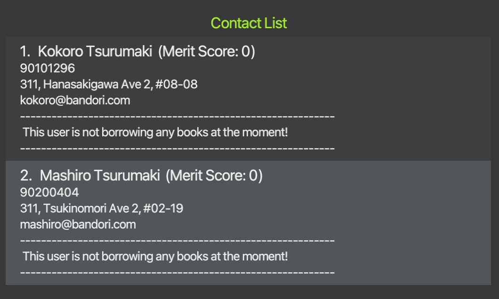

### Editing a library user : `edit`

Edits an existing library user's personal information from the contact list.

Format: `edit INDEX [n/NAME] [p/PHONE] [e/EMAIL] [a/ADDRESS] [t/TAG]…​`

* Edits the library user at the specified `INDEX`. This index refers to the index number of the target library user in the contact list.
* At least one of the optional parameters must be provided.
* Existing values in the contact list will be updated to the input values.
* When editing tags, the existing tags of the library user will be removed i.e adding of tags is not cumulative.
* You can remove all the library user’s tags by typing `t/` without specifying any tags after it.

Example:
*  `edit 2 n/Mashiro Kurata` edits the name of the 2nd person to be `Mashiro Kurata`.


    Before edit:


    Edit:


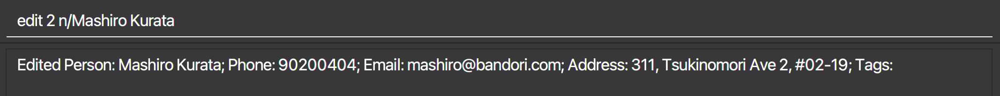


### Locating library users by name: `find`

Finds library users whose names matches any of the given keywords.

Format: `find KEYWORD [MORE_KEYWORDS]`

* The search (`KEYWORD`) is case-insensitive. e.g `hans` will match `Hans`
* The order of the keywords does not matter. e.g. `Hans Bo` will match `Bo Hans`
* Only the name is searched.
* Only full words will be matched e.g. `Han` will not match `Hans`
* All library users matching at least one keyword will be returned (i.e. `OR` search).
  e.g. `Hans Bo` will return `Hans Gruber`, `Bo Yang`

Example:
* `find kokoro mashiro` returns `Kokoro Tsurumaki`, `Mashiro Kurata`
  


  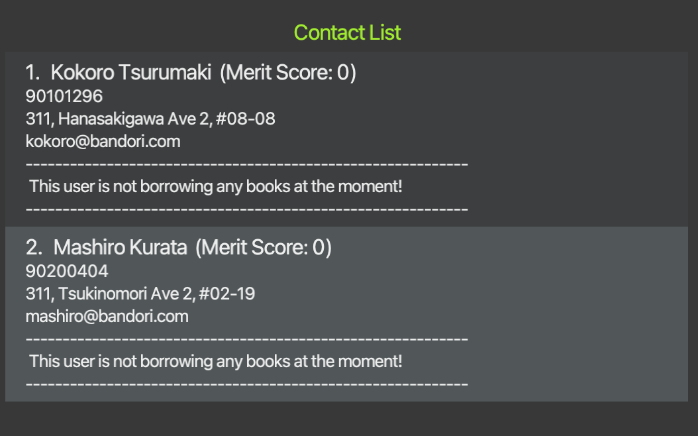

### Deleting a library user : `delete`

Deletes the specified library user from the contact list through its index.

Format: `delete INDEX`

* Deletes the library user at the specified `INDEX`.
* The index refers to the index number associated with the target library user.

<box type="warning" seamless>

**Warning:** `delete` removes all the target user's data, including their merit score and borrowing book list.

</box>

Examples:
* `list` followed by `delete 2` deletes the 2nd user in the contact list.
* `find kokoro mashiro` followed by `delete 2` deletes the 2nd user in the results of the `find` command.


    Before delete:


    Delete:


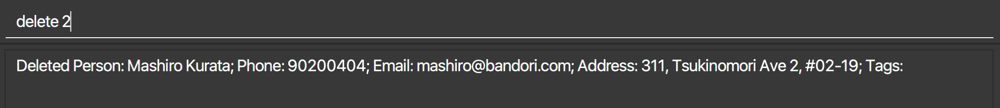


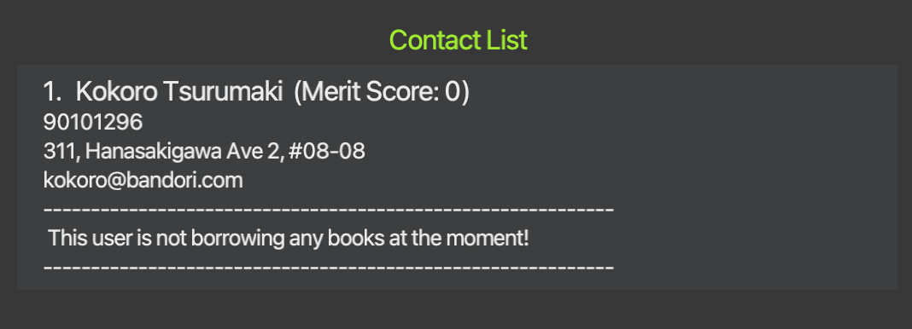

### Add a book to Library : `addbook`

Adds a book to the library's book list.

Format: `addbook b/BOOKTITLE`

* Adds a book `BOOKTITLE` to the library and stores it.

Example:
* `addbook b/Tales of Kokoro` will add a book titled "Tales of Kokoro" into the library.


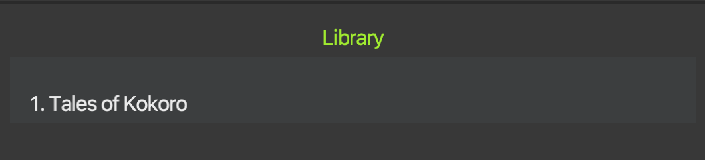

### Delete a book from Library : `delbook`

Removes a book from the library's book list.

Format: `delbook b/BOOKTITLE`

* Remove the first book titled `BOOKTITLE` from the library.

<box type="warning" seamless>

**Warning:** To avoid accidental deletion, `delbook` only removes the first book which matches `BOOKTITLE`, even there are multiple books with identical `BOOKTITLE`.

</box>

Example:
* `delbook b/Tales of Kokoro` will remove a book titled "Tales of Kokoro" from the library.


### Borrowing a book: `borrow`

Library user borrows a book. A book is removed from the library's book list and added to the library user's book list.

Format: `borrow INDEX b/BOOKTITLE`

* Library user at position `INDEX` in the contact list borrows a book titled `BOOKTITLE`.
* This index refers to the index number associated with the target library user in the contact list.
* Borrowing a book decreases the library user's merit score by 1.

Example:
* `borrow 1 b/Tales of Kokoro` will record the user index 1 borrowing a book titled "Tales of Kokoro".


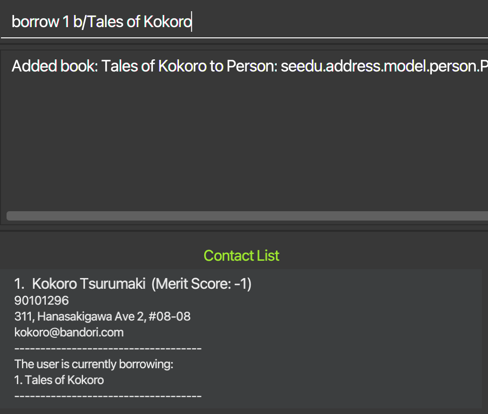

### Returning a book : `return`

Library user returns a book. A book is removed from the library user's book list and added to the library's book list.

Format: `return INDEX b/BOOKTITLE`

* Library user at position `INDEX` in the contact list returns a book titled `BOOKTITLE`.
* This index refers to the index number associated with the target library user in the contact list.
* Returning a book increases the library user's merit score by 1.

Example:
* `return 1 b/Tales of Kokoro` returns a book titled "Tales of Kokoro" from the user at index 1.<br>


### Donating a book : `donate`

Library user donates a book. A book is added to the library's book list.

Format: `donate INDEX b/BOOKTITLE`

* Library user at position `INDEX` in the contact list donates a book titled `BOOKTITLE`.
* This index refers to the index number associated with the target library user in the contact list.
* Donating a book increases the library user's merit score by 1.

<box type="note" seamless>

**Note:** This differs from `addbook` as this command also increases the merit score of the associated library user.

</box>

Example:
* `donate 1 b/Tales of Kokoro` will record user index 1 donating a book titled "Tales of Kokoro".


### Set the merit score threshold of the library: `limit`

Sets the limit of the library such that only users with a merit score more than or equal to the set limit can borrow.

Format: `limit [THRESHOLD]`

* Sets the limit of the merit score to the specified `THRESHOLD`.
* The limit refers to the threshold such that any library user with a merit score less the `THRESHOLD` is not allowed to borrow from the library.
* `THRESHOLD` is optional. Typing `limit` without `THRESHOLD` will display the currently set threshold.
* The default threshold set for libraries is -3.

Examples:
* `limit` will display the current merit score limit.


* `limit -10` will set the merit score limit of the library to -10.


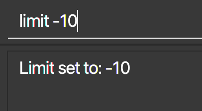

### Clearing all library users : `clear`

Clears all entries of library users from the contact list.

Format: `clear`

<box type="note" seamless>

**Note:** `clear` only supports clearing all users in the contact list. To clear all books from the library, refer to the tutorial on [clearing the library](#how-to-clear-the-whole-library).

</box>

### Exiting the program : `exit`

Exits the program.

Format: `exit`

[//]: # (### )

[//]: # ()
[//]: # (Description)

[//]: # ()
[//]: # (Format: ``)

### Saving the data

MyBookshelf offers an automated data saving feature.

This ensures that any modifications to your library's records will be preserved on your hard disk without necessitating manual intervention.

This functionality simplifies your workflow by automatically saving your progress, enabling seamless continuation from your last session upon reopening the application.

MyBookshelf also focuses on data integrity, guaranteeing that only accurate records are maintained within the system.

Invalid data for available books will be automatically discarded and will not be saved.


### Editing the data files

User data in *MyBookshelf* is saved automatically as a JSON file at `[JAR file location]/data/addressbook.json`.

Library book data in *MyBookshelf* is saved automatically as a .txt file at `[JAR file location]/data/library.txt`.

Experienced users are welcome to make changes to the data directly by editing these data files.

<box type="warning" seamless>

**Warning:**
If your changes to the data file makes its format invalid, MyBookshelf will discard all saved data and start with an empty data file at the next run. <br>
Hence, it is recommended to have a backup of the file ready before editing it.<br>
Furthermore, certain edits can cause the MyBookshelf to behave in unexpected ways (e.g., if a value entered is outside the acceptable range). Therefore, edit the data file only if you are confident that you can update it correctly.

</box>

--------------------------------------------------------------------------------------------------------------------

## Things to Note

1. Every library user starts with a default merit score of 0.
1. **ONLY** library users with a **Merit Score >= Threshold** are allowed to borrow books.
1. Library users can borrow multiple books as long as their merit score is above the threshold.
1. The default threshold is set at -3. Use the [`limit`](#set-the-merit-score-threshold-of-the-library--limit) command to set the threshold.
1. [`edit`](#editing-a-library-user--edit) can only be used to change the library user's personal information. This includes his/her name, phone number, email address, home address and tags. (Not merit score and user's book list).
1. [`add`](#adding-a-library-user--add) and [`edit`](#editing-a-library-user--edit) command **DOES NOT** support the direct adding and/or editing of merit score or user's book list.
1. [`add`](#adding-a-library-user--add), [`delete`](#deleting-a-library-user--delete), [`edit`](#editing-a-library-user--edit), [`clear`](#clearing-all-library-users--clear) and [`find`](#locating-library-users-by-name--find) commands are for managing users, while [`addbook`](#add-a-book-to-library--addbook), [`delbook`](#delete-a-book-from-library--delbook), [`borrow`](#borrowing-a-book--borrow), [`donate`](#donating-a-book--donate) and [`return`](#returning-a-book--return) commands are for managing books.
1. The parameter `BOOKTITLE` is case-sensitive to allow books of similar titles to be differentiated.
1. While there are no restrictions on `BOOKTITLE` (expect that it cannot be empty), we cannot guarantee the performance when books with titles in other languages are inserted.
1. [`delbook`](#delete-a-book-from-library--delbook) deletes one book at a time to prevent accidental deletion of all entries with the same book title.
1. We allow entries with the same email and phone number into the contact list as there may be cases where two users share the same contact details. An example would be when a child does not own a mobile phone nor has an email and has to share with his/her parent.
1. Commands that modifies book lists will reference the book using their respective book titles instead of their indexes. This is because the [`findbook`](#introducing-the-findbook-command) command has not been implemented yet and would make indexing specific books in a large book list unfeasible.
1. We allow [`delete`](#deleting-a-library-user--delete) to remove the library user's book list. This allows for more flexibility in managing the library. If books are returned, the library manager can use the [`return`](#returning-a-book--return) command to account for the books before deleting the person.
1. Do not use words that start with b/, a/ as part of booktitles and addressess respectively. Tip: If you have a word starting with b/ or a/, you can type a filler character before.
   E.g. addbook b/Book with .b/ in the title.

--------------------------------------------------------------------------------------------------------------------

## Future Features

### Introducing more flexibility for `clear`
1. Will be adding a `clearlib` command to clear all books currently in the library.
2. Will rename the current `clear` command to `clearuser` to clear all the data of library users.
3. Will be adding a `clearall` command to clear both library book and library user data.

### Introducing the `findbook` command
1. As the number of books in the library increases, the library manager has to spend more time scrolling through the list to search for a book.
2. The `findbook` command will allow the library manager quickly check for the existence of a specific book in the library.
3. This will also allow us to explore the use of indexing to run commands that modify the book list instead of having to do so with the lengthy book title.

### Introducing the `undo` and `redo` commands
1. Even the most meticulous and fastest typists are bound to make some unintended errors.
2. With the `undo` command, user experience will be enhanced as these mistakes can be reverted with a simple yet effective command.
3. Similarly, the addition of the `redo` command further improves user experience by allowing users to effortlessly revert back to undone actions, refining the process.

--------------------------------------------------------------------------------------------------------------------

## FAQ

**Q**: How do I transfer my data to another Computer?<br>
**A**: Install the app in the other computer and overwrite the empty data file it creates with the file that contains the data of your previous MyBookshelf home folder.

**Q**: How do I manually change the merit score of a library user that I have added?<br>
**A**: Please read the tutorial section on [increasing](#how-to-increase-merit-score-of-a-library-user) and [decreasing](#how-to-decrease-merit-score-of-a-library-user) merit score.

**Q**: Can I clear both the contact list and the library at the same time?
**A**: Unfortunately, *MyBookshelf* currently cannot clear both the contact list and the library at the same time. You can use the [`clear`](#clearing-all-library-users--clear) command to clear the contact list and refer to [this](#how-to-clear-the-whole-library) section to clear the library.

--------------------------------------------------------------------------------------------------------------------

## Known issues

1. **When using multiple screens**, if you move the application to a secondary screen, and switch back to the primary screen, the GUI will open off-screen. The remedy is to delete the `preferences.json` file created by the application before running the application again.
2. Email does not check for presence of **top-level domain**, such as `.com`, `.net` and `.org`. Refer to the Developer Guide for more information.
3. When a value beyond the range `-2147483648 to 2147483647` is used for `INDEX` and `THRESHOLD`, the wrong error message is displayed. Will be fixed in the future. Refer to the Developer Guide for more information.
4. There can be different individuals with the same name, but our current implementation does not support this due to our definition of duplicated people. Will be fixed in the future. Refer to the Developer Guide for more information.
5. Duplicated library users can be added with the same name but different capitalisation, due to our definition of duplicated people. Will be fixed in the future. Refer to the Developer Guide for more information.
6. All parameters except `INDEX` and `THRESHOLD` do not have a limit to the number of characters. Refer to the Developer Guide for more information.
7. The [`clear`](#clearing-all-library-users--clear) command only clears the library user data. The usage pertaining to this command will be made clearer with the implementation of future features. Refer to the [Future Features](#future-features) section above for more information.
8. UI may not display special characters as intended.
9. Some languages may cause the UI to display unexpectedly. For example, Arabic characters will cause the number next to book titles to appear from right to left.

--------------------------------------------------------------------------------------------------------------------

## Tutorials

### How to increase Merit Score of a library user

With the current features, there is no direct command to manually increase the merit score of a library user. 

You can use the following steps below to indirectly increase the merit score of an individual library user:
1. Make the library user whose merit score you want to increase donate a placeholder book using [`donate`](#donating-a-book--donate).
1. Repeat step 1 by the amount you want to increase the library user's merit score by.
1. Delete **all** the placeholder books that you had added from the library using [`delbook`](#delete-a-book-from-library--delbook).

Example: You want to increase the merit score of the third library user by 2.
1. Enter `donate 3 b/placeholder book`.
1. Enter `donate 3 b/placeholder book`.
1. Enter `delbook b/placeholder book`.
1. Enter `delbook b/placeholder book`.

### How to decrease Merit Score of a library user

With the current features, there is no direct command to manually decrease the merit score of a library user.

#### Method 1: Within MyBookshelf

<box type="warning" seamless>

**Warning:** Due to current limitations, following this method **will force** the library user to alter their list of books

</box>

You can use the following steps below to indirectly increase the merit score of an individual library user:
1. Add placeholder books from the library using [`addbook`](#add-a-book-to-library--addbook).
1. Repeat step 1 by the amount you want to decrease the library user's merit score by.
1. Make the library user whose merit score you want to increase borrow **all** the placeholder books you added using [`borrow`](#borrowing-a-book--borrow).

Example: You want to decrease the merit score of the second library user by 2.
1. Enter `addbook b/~~~ignore book~~~`.
1. Enter `addbook b/~~~ignore book~~~`.
1. Enter `borrow 2 b/~~~ignore book~~~`.
1. Enter `borrow 2 b/~~~ignore book~~~`.

<box type="tip" seamless>

**Tips:** Since these placeholder books will stay in the library user's book list, you should name your placeholder books with names that can be easily differentiated and ignored.

Keeping the placeholder books titled the same and using characters that can be sorted to the bottom alphabetically (use larger values in this [chart](https://www.javatpoint.com/java-ascii-table)) can also help.

</box>

#### Method 2: Editing the data file

Using this method will not alter the library user's book list. Please read the above section on [Editing Data Files](#editing-the-data-files) before proceeding.

1. Locate the data file at this file location: `[JAR file location]/data/addressbook.json`
1. Open the file with any valid application of your choice. For this example, we will open the file with Notepad on Windows.
1. Locate the library user you wish to edit and edit their merit score.

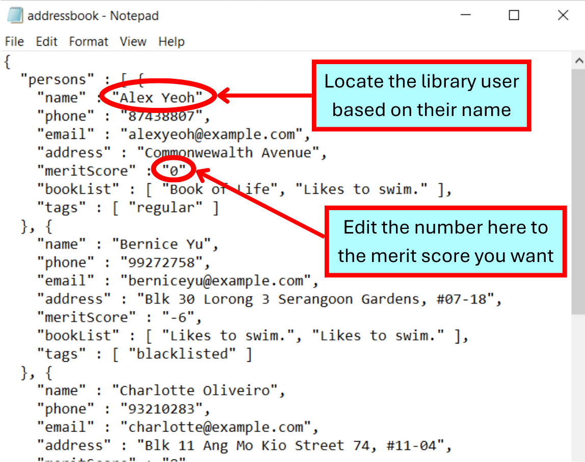

### How to clear the whole library

The current [`clear`](#clearing-all-library-users--clear) command is designed to clear the contact list only but there is **no command** to clear books from the library.

The **safest** method to clear the library would be to individually delete each book from the library using the `delbook` command.

You can quickly delete books from the library by directly editing the data file. Please read the above section on [Editing Data Files](#editing-the-data-files) before proceeding.

1. Locate the data file at this file location: `[JAR file location]/data/library.txt`
1. Open the file with any text editor of your choice. For this example, we will open the file with Notepad on Windows.
1. Delete all lines after the first line (first line is the number you have set as the limit for your library).


<box type="warning" seamless>

**Warning:** In this version of *MyBookshelf*, you can put in an invalid input into the `library.txt` file (E.g. non-number for merit score/whitespace for book title) and the data file will be treated as corrupted, causing the program to start up with an empty library.

While this is a method you can also use to clear the library, we highly advise against purposefully corrupting your own data files as you will reset the limit you have set for your library.

We also cannot guarantee that this will not cause unexpected behaviour in other parts of *MyBookshelf* and this may not work for future versions of *MyBookshelf*.

</box>

--------------------------------------------------------------------------------------------------------------------

## Command summary

| Action      | Format, Examples                                                                                                                                                         |
|-------------|--------------------------------------------------------------------------------------------------------------------------------------------------------------------------|
| **Add**     | `add n/NAME p/PHONE_NUMBER e/EMAIL a/ADDRESS [t/TAG]…​` <br> e.g., `add n/James Ho p/22224444 e/jamesho@example.com a/123, Clementi Rd, 1234665 t/goodDonater t/sponsor` |
| **Clear**   | `clear`                                                                                                                                                                  |
| **Delete**  | `delete INDEX`<br> e.g., `delete 3`                                                                                                                                      |
| **Edit**    | `edit INDEX [n/NAME] [p/PHONE_NUMBER] [e/EMAIL] [a/ADDRESS] [t/TAG]…​`<br> e.g.,`edit 2 n/James Lee e/jameslee@example.com`                                              |
| **Find**    | `find KEYWORD [MORE_KEYWORDS]`<br> e.g., `find James Jake`                                                                                                               |
| **List**    | `list`                                                                                                                                                                   |
| **Help**    | `help`                                                                                                                                                                   |
| **AddBook** | `addbook b/BOOKTITLE`<br> e.g., `addbook b/Tales of Kokoro`                                                                                                              |
| **DelBook** | `delbook b/BOOKTITLE`<br> e.g., `delbook b/Tales of Kokoro`                                                                                                              |
| **Borrow**  | `borrow INDEX b/BOOKTITLE`<br> e.g., `borrow 1 b/Tales of Kokoro`                                                                                                        |
| **Return**  | `return INDEX b/BOOKTITLE`<br> e.g., `return 1  b/Tales of Kokoro`                                                                                                       |
| **Donate**  | `donate INDEX b/BOOKTITLE`<br> e.g., `donate 1 b/Tales of Kokoro`                                                                                                        |
| **Limit**   | `limit [THRESHOLD]` <br> e.g. `limit 0`                                                                                                                                  |

--------------------------------------------------------------------------------------------------------------------

## Glossary

1. **CLI**: Command-Line Interface, a tool you employ to communicate with your operating system via your keyboard.

1. **GUI**: Graphical User Interface, a graphical interface where users engage with visual elements like icons, buttons, and menus.

1. **JSON**: JavaScript Object Notation, a text format for storing and transporting data.

1. **Parameter**: Data that users input into commands.

1. **Alphanumeric**: A character that is either a letter or a number.

1. **Library User**: The people that are saved into the contact list of *MyBookshelf*. Sometimes referred to as "borrowers".

1. **Library Manager**: Community Library Managers (CLM) are the people using the MyBookshelf application. CLMs are responsible for adding, storing, and updating the entire library database via *MyBookshelf*.

1. **Contact List**: Refers to the list of library users currently stored in the *MyBookshelf* application. It appears in the left column of the User Interface.

1. **Book**: Identified by its `BOOKTITLE`. Appears in both the `User's Book List` and the `Library Book List`.

1. **User's Book List**: Refers to the list of `Book`(s) currently borrowed by an individual library user.

1. **Library Book List**: Refers to the list of available `Book`(s) currently stored in the *MyBookshelf* application. It appears in the right column of the User Interface. Sometimes referred to as "available books" or simply "library".

1. **Command**: Instructions given to the application to perform specific tasks.

1. **Merit Score**: A score associated with each `Library User`. This score provides an estimate of the number of books a library user can borrow.

1. **Limit**: Refers to limit set for the library and is synonymous with `THRESHOLD`, where library users are only allowed to borrow books when their merit score is greater or equal than the limit that has been set.

1. **Threshold**: The minimum merit score required for a library user to borrow books from the library.

1. **Data Saving**: The automated feature of the application that preserves modifications to the library's records by saving them on the hard disk.
