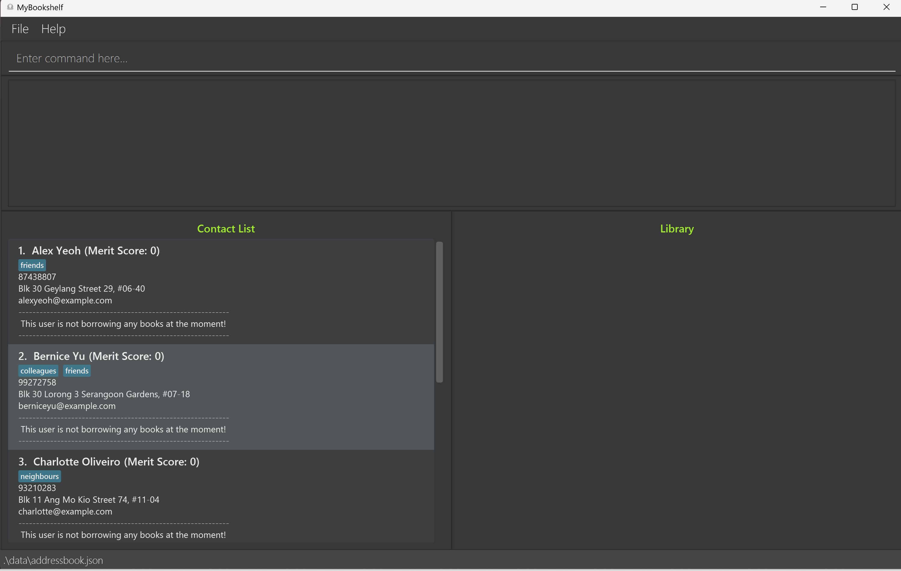
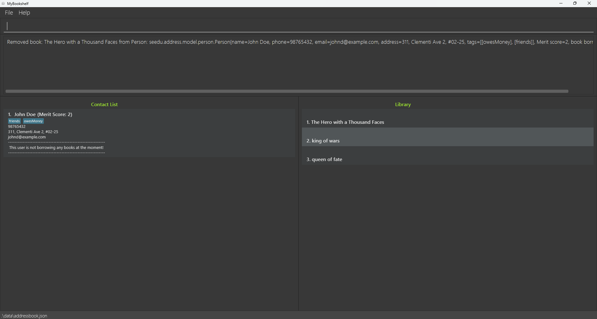

# MyBookshelf User Guide

MyBookshelf is a **desktop app for librarians managing contacts, books and borrowing status of borrowers, optimized for use via a Command Line Interface** (CLI) while still having the benefits of a Graphical User Interface (GUI). If you can type fast, MyBookshelf can get your contact and borrowing management tasks done faster than traditional GUI apps.

<!-- * Table of Contents -->
<page-nav-print />

--------------------------------------------------------------------------------------------------------------------

## Quick start

1. Ensure you have Java `11` or above installed in your Computer.

1. Download the latest `MyBookshelf.jar` from [here](https://github.com/AY2324S2-CS2103T-F11-2/tp/releases).

1. Copy the file to the folder you want to use as the _home folder_ for your MyBookshelf app.

1. Open a command terminal, `cd` into the folder you put the jar file in, and use the `java -jar MyBookshelf.jar` command to run the application. 
   A GUI similar to the below should appear in a few seconds. Note how the app contains some sample data. 
   

1. Type the command in the command box and press Enter to execute it. e.g. typing **`help`** and pressing Enter will open the help window. 
   Some example commands you can try:

    * `list` : Lists all contacts.

    * `add n/John Doe p/98765432 e/johnd@example.com a/John street, block 123, #01-01` : Adds a contact named `John Doe` to User List.

    * `delete 3` : Deletes the 3rd contact shown in the User List.

    * `clear` : Deletes all contacts.

    * `exit` : Exits the app.

1. Refer to the [Features](#features) below for details of each command.

--------------------------------------------------------------------------------------------------------------------

## Features

<box type="info" seamless>

**Notes about the command format:** 

* Words in `UPPER_CASE` are the parameters to be supplied by the user. 
  e.g. in `add n/NAME`, `NAME` is a parameter which can be used as `add n/John Doe`.

* Items in square brackets are optional. 
  e.g `n/NAME [t/TAG]` can be used as `n/John Doe t/friend` or as `n/John Doe`.

* Items with `…`​ after them can be used multiple times including zero times. 
  e.g. `[t/TAG]…​` can be used as ` ` (i.e. 0 times), `t/friend`, `t/friend t/family` etc.

* Parameters can be in any order. 
  e.g. if the command specifies `n/NAME p/PHONE_NUMBER`, `p/PHONE_NUMBER n/NAME` is also acceptable.

* Extraneous parameters for commands that do not take in parameters (such as `help`, `list`, `exit` and `clear`) will be ignored. 
  e.g. if the command specifies `help 123`, it will be interpreted as `help`.

* If you are using a PDF version of this document, be careful when copying and pasting commands that span multiple lines as space characters surrounding line-breaks may be omitted when copied over to the application.
</box>

### Viewing help : `help`

Shows a message explaining how to access the help page.

Format: `help`

### Adding a user: `add`

Adds a user with user's personal information into the User List .

Format: `add n/NAME p/PHONE_NUMBER e/EMAIL a/ADDRESS [t/TAG]…​`

<box type="tip" seamless>

**Tip:** A user can have any number of tags (including 0)
</box>

Examples:
* `add n/John Doe p/98765432 e/johnd@example.com a/John street, block 123, #01-01`
* `add n/Betsy Crowe t/friend e/betsycrowe@example.com a/Newgate Prison p/1234567 t/criminal`

### Listing all users : `list`

Shows a list of all users in the User List.

Format: `list`

### Editing a user : `edit`

Edits an existing user's personal information from the User List.

Format: `edit INDEX [n/NAME] [p/PHONE] [e/EMAIL] [a/ADDRESS] [t/TAG]…​`

* Edits the user at the specified `INDEX`. The index refers to the index number shown in the displayed User List. The index **must be a positive integer** 1, 2, 3, …​
* At least one of the optional fields must be provided.
* Existing values will be updated to the input values.
* When editing tags, the existing tags of the user will be removed i.e adding of tags is not cumulative.
* You can remove all the user’s tags by typing `t/` without
  specifying any tags after it.

Examples:
*  `edit 1 p/91234567 e/johndoe@example.com` Edits the phone number and email address of the 1st user to be `91234567` and `johndoe@example.com` respectively.
*  `edit 2 n/Betsy Crower t/` Edits the name of the 2nd person to be `Betsy Crower` and clears all existing tags.

### Locating users by name: `find`

Finds users whose names contain any of the given keywords.

Format: `find KEYWORD [MORE_KEYWORDS]`

* The search is case-insensitive. e.g `hans` will match `Hans`
* The order of the keywords does not matter. e.g. `Hans Bo` will match `Bo Hans`
* Only the name is searched.
* Only full words will be matched e.g. `Han` will not match `Hans`
* Users matching at least one keyword will be returned (i.e. `OR` search).
  e.g. `Hans Bo` will return `Hans Gruber`, `Bo Yang`

Examples:
* `find John` returns `john` and `John Doe`
* `find alex david` returns `Alex Yeoh`, `David Li` 
  

### Deleting a user : `delete`

Deletes the specified user from the User List using index.

Format: `delete INDEX`

* Deletes the user at the specified `INDEX`.
* The index refers to the index number shown in the displayed User List.
* The index **must be a positive integer** 1, 2, 3, …​

Examples:
* `list` followed by `delete 2` deletes the 2nd user in the User List.
* `find Betsy` followed by `delete 1` deletes the 1st user in the results of the `find` command.

### Borrow a book by a user: `borrow`

Borrow a book from the library by a user.

Format: `borrow INDEX [b/BOOKTITLE]`

* Borrow the book with `BOOKTITLE` to user `INDEX`.
* The index refers to the index number shown in the displayed User List.
* The index **must be a positive integer** 1, 2, 3, …​

Examples:
* `borrow 2 b/I Love CS2103T CS2101` will record user index 2, borrows a book called "I Love CS2103T CS2101".
* `borrow 4 b/The Hero with a Thousand Faces` will record user index 4, borrows a book called "The Hero with a Thousand Face".  
  

### Return a book from a user : `return`

Returns the specified book borrowed by the specified user.

Format: `return INDEX [b/BOOKTITLE]`

* Return a book `BOOKTITLE` borrowed by user `INDEX`.
* The index `INDEX` refers to the index number shown in the displayed User List.
* The index **must be a positive integer** 1, 2, 3, …​

Examples:
* `return 2 b/I Love CS2103T CS2101` returns a book of title "I Love CS2103T CS2101" from the user at index 2.
* `return 4 b/The Hero with a Thousand Faces` returns a book of title "The Hero with a Thousand Face" from the user at index 4.

### Donate a book from a user : `donate`

Records a user donating a book to the library.

Format: `donate INDEX [b/BOOKTITLE]`

* A user `INDEX` has donated book `BOOKTITLE`.
* The index refers to the index number shown in the displayed User List.
* The index **must be a positive integer** 1, 2, 3, …​

Examples:
* `donate 2 b/I Love CS2103T CS2101` will record user index 2, donates a book called "I Love CS2103T CS2101".
* `donate 4 b/The Hero with a Thousand Faces` will record user index 4, donates a book called "The Hero with a Thousand Face".

### Setting/Viewing the limit for the library

Sets the limit of the library. such that only users with a merit score more than or equal to the set limit can borrow.

Format: `limit [SET_LIMIT]`

* Sets the limit to the specified `SET_LIMIT`.
* The limit refers to the threshold such that any user with a merit score less the `SET_LIMIT` is not allowed to borrow from the library.
* `SET_LIMIT` can be any integer.
* `SET_LIMIT` is optional. Typing `limit` without `SET_LIMIT` will display the currently set limit.
* The default limit set for libraries is -3.

Examples:
* `limit -4` will set the limit of the library to -4
* `limit` will display the current limit.

### Clearing all entries : `clear`

Clears all entries from the User List.

Format: `clear`

### Exiting the program : `exit`

Exits the program.

Format: `exit`

[//]: # (### )

[//]: # ()
[//]: # (Description)

[//]: # ()
[//]: # (Format: ``)

### Saving the data

MyBookshelf data are saved in the hard disk automatically after any command that changes the data. There is no need to save manually.
Data will be restored once you open the application again allowing user to continue from where they left off.
Invalid data for available books will be discarded automatically and that particular data will not be saved.

### Editing the data file

MyBookshelf user's data are saved automatically as a JSON file `[JAR file location]/data/MyBookshelf.json`.
MyBookshelf library available books data are saved automatically as a txt file at `[JAR file location]/data/library.txt`.
Advanced users are welcome to update data directly by editing that data file.

<box type="warning" seamless>

**Caution:**
If your changes to the data file makes its format invalid, MyBookshelf will discard all data and start with an empty data file at the next run.  Hence, it is recommended to take a backup of the file before editing it. 
Furthermore, certain edits can cause the MyBookshelf to behave in unexpected ways (e.g., if a value entered is outside the acceptable range). Therefore, edit the data file only if you are confident that you can update it correctly.
</box>

### Archiving data files `[coming in v2.0]`

_Details coming soon ..._

--------------------------------------------------------------------------------------------------------------------

## Note

1. Every user starts from merit score 0.
1. Donating increases merit score by 1.
1. Borrowing is **ONLY** allowed for user with **Merit Score >= Threshold** (Threshold can be set by using `Limit` Command.
1. Users can borrow multiple books as long as they have sufficient merit score.
1. The default threshold is set at -3.
1. Threshold can be set by librarian multiple times.
1. `Edit` command only supports editing user's personal information (name, phone number, email, address and tags, but not merit score and borrowed books).
1. `Add` command is used to record new user's personal information into the User List.
1. `Add` and `Edit` Command **DOES NOT** support adding/editing merit score or borrowed book.
1. Only `Borrow`, `Donate` and `Return` commands are for managing books.

--------------------------------------------------------------------------------------------------------------------

## FAQ

**Q**: How do I transfer my data to another Computer? 
**A**: Install the app in the other computer and overwrite the empty data file it creates with the file that contains the data of your previous MyBookshelf home folder.

--------------------------------------------------------------------------------------------------------------------

## Known issues

1. **When using multiple screens**, if you move the application to a secondary screen, and later switch to using only the primary screen, the GUI will open off-screen. The remedy is to delete the `preferences.json` file created by the application before running the application again.
2. **Book title can be of any length** There is no limit to the length of the book title.

--------------------------------------------------------------------------------------------------------------------

## Command summary

| Action     | Format, Examples                                                                                                                                                      |
|------------|-----------------------------------------------------------------------------------------------------------------------------------------------------------------------|
| **Add**    | `add n/NAME p/PHONE_NUMBER e/EMAIL a/ADDRESS [t/TAG]…​`   e.g., `add n/James Ho p/22224444 e/jamesho@example.com a/123, Clementi Rd, 1234665 t/friend t/colleague` |
| **Clear**  | `clear`                                                                                                                                                               |
| **Delete** | `delete INDEX`  e.g., `delete 3`                                                                                                                                   |
| **Edit**   | `edit INDEX [n/NAME] [p/PHONE_NUMBER] [e/EMAIL] [a/ADDRESS] [t/TAG]…​`  e.g.,`edit 2 n/James Lee e/jameslee@example.com`                                           |
| **Find**   | `find KEYWORD [MORE_KEYWORDS]`  e.g., `find James Jake`                                                                                                            |
| **List**   | `list`                                                                                                                                                                |
| **Help**   | `help`                                                                                                                                                                |
| **Borrow** | `borrow INDEX BOOKTITLE`  e.g., `borrow 1 b/The Hero with a Thousand Faces`                                                                                        |
| **Return** | `return INDEX BOOKTITLE`  e.g., `return 1  b/The Hero with a Thousand Faces`                                                                                       |
| **Donate** | `donate INDEX BOOKTITLE`  e.g., `donate 1 b/The Hero with a Thousand Faces`                                                                                        |
| **Limit**  | `limit SET_LIMIT`   e.g. `limit 0`                                                                                                                                 |
